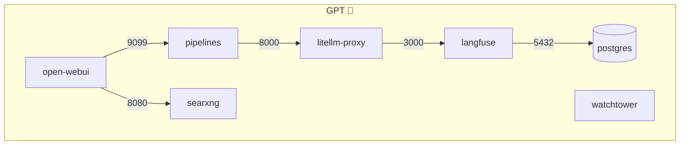
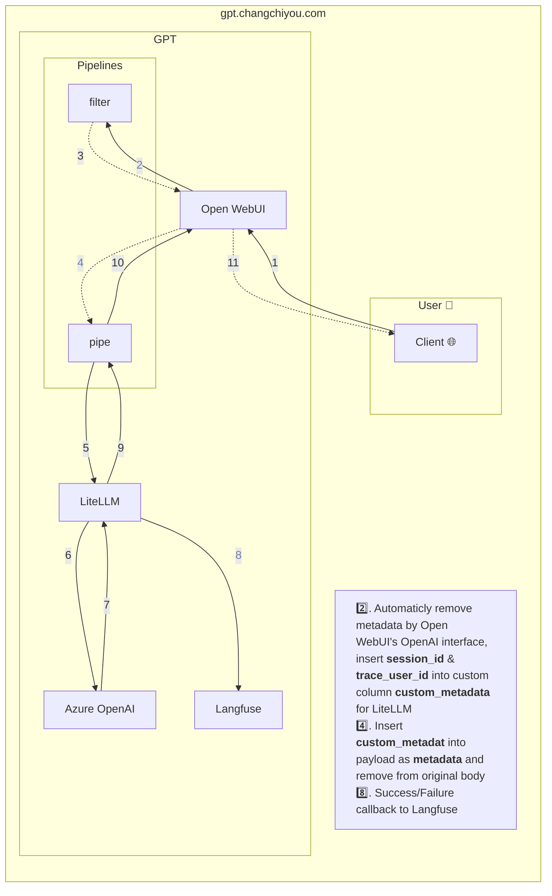

# FTC GPT

FTC GPT employs Azure OpenAI to mitigate the risk of internal data leakage during the use of ChatGPT, safeguarding important information from being utilized in OpenAI's training datasets by our company colleagues.

## Installation

Follow these steps to set up and run `FTC GPT`:

1. Clone the repository to your local development environment and navigate to the project directory using the `cd` command.

    ```bash
    git clone https://github.com/dev-cloud-ftc/FTC-GPT.git; cd FTC-GPT
    ```

2. Copy the [example.env](/example.env) file and rename it to `.env`. Fill in the required environment variables for `postgres` & `langfuse` containers:

    https://github.com/dev-cloud-ftc/FTC-GPT/blob/26ac1118bc064e3d0e8f5a69924f8c1c6047dec7/example.env#L20-L28

3. Set `LANGFUSE_SECRET_KEY` & `LANGFUSE_PUBLIC_KEY` from `langfuse`:

    Run the following command to start `langfuse`:

    ```
    docker compose -f docker-compose.langfuse.yml up
    ```

    Generate a pair of secret / public key and paste them into `.env`:

    https://github.com/dev-cloud-ftc/FTC-GPT/blob/26ac1118bc064e3d0e8f5a69924f8c1c6047dec7/example.env#L17-L18

4. Set the remaining environment variables in `.env`:

    https://github.com/dev-cloud-ftc/FTC-GPT/blob/26ac1118bc064e3d0e8f5a69924f8c1c6047dec7/example.env#L1-L16

5. Copy the [example.config.yaml](/litellm/example.config.yaml) file and rename it to `config.yaml`. Refer to the comments to fill in the required environment variables.

   > If you have specific requirements, you may refer to [LiteLLM - Proxy Config.yaml](https://docs.litellm.ai/docs/proxy/configs) and [LiteLLM - Providers](https://docs.litellm.ai/docs/providers) for guidance.

   https://github.com/dev-cloud-ftc/FTC-GPT/blob/ae404f60111aef3bb32e617cae7b84975542937f/litellm/example.config.yaml#L1-L23

6. Replace the example key with your own private api key:

   https://github.com/dev-cloud-ftc/FTC-GPT/blob/870dc4a1c2fb3a15f7cd25fc846746748e0536f9/example.env#L12

   https://github.com/dev-cloud-ftc/FTC-GPT/blob/870dc4a1c2fb3a15f7cd25fc846746748e0536f9/searxng/settings.yml#L5

7. Run the following command to start `FTC GPT` using Docker Compose:

    ```bash
    docker compose -f docker-compose.yml -f docker-compose.searxng.yml -f docker-compose.langfuse.yml -f docker-compose.litellm.yml -p openwebui up -d
    ```

    Restart docker compose:
    ```bash
    docker compose -f docker-compose.yml -f docker-compose.searxng.yml -f docker-compose.langfuse.yml -f docker-compose.litellm.yml -p openwebui stop && docker compose -f docker-compose.yml -f docker-compose.searxng.yml -f docker-compose.langfuse.yml -f docker-compose.litellm.yml -p openwebui up -d
    ```

    > ## ppt
    > ```bash
    > docker compose -f docker-compose.yml -f docker-compose.searxng.yml -f docker-compose.langfuse.yml -f docker-compose.ppt.yml -f docker-compose.litellm.yml -p openwebui up -d
    > ```
    >
    > Restart docker compose:
    > ```bash
    > docker compose -f docker-compose.yml -f docker-compose.searxng.yml -f docker-compose.langfuse.yml -f docker-compose.ppt.yml -f docker-compose.litellm.yml -p openwebui stop && docker compose -f docker-compose.yml -f docker-compose.searxng.yml -f docker-compose.langfuse.yml -f docker-compose.ppt.yml -f docker-compose.litellm.yml -p openwebui up -d
    > ```

8. Once Docker Compose has successfully started the services, open your web browser and navigate to the following URLs(localhost, default ports) to access the respective applications:

    |App|Service|URLs|
    |-|-|-|
    |:star2: Open WebUI|Main Page|`localhost:5003`
    |Open WebUI|:books: FastAPI docs|`localhost:5003/api/v1/docs`|
    |:bullettrain_front: LiteLLM.proxy|:books: FastAPI docs|`localhost:4000`|
    |Langfuse|:chart_with_upwards_trend: Monitoring Dashboard|`localhost:3000`|
    |:mag_right: SearXNG|:globe_with_meridians: Web Search Engine|`localhost:8080`|

## Architecture Overview

### Docker-Compose



### Message Flow


