# FTC GPT

FTC GPT employs Azure OpenAI to mitigate the risk of internal data leakage during the use of ChatGPT, safeguarding important information from being utilized in OpenAI's training datasets by our company colleagues.

## Installation

Follow these steps to set up and run this project locally:

1. Clone the repository to your local development environment and navigate to the project directory using the `cd` command.

    ```bash
    git clone git@github.com:changchiyou/Docker.git; cd openwebui
    ```

2. Copy the [example.env](/example.env) file and rename it to `.env`. Fill in the required environment variables.
5. Copy the [example.config.yaml](/litellm/example.config.yaml) file and rename it to `config.yaml`. Refer to the comments to fill in the required environment variables.   
   > If you have specific requirements, you may refer to [LiteLLM - Proxy Config.yaml](https://docs.litellm.ai/docs/proxy/configs) and [LiteLLM - Providers](https://docs.litellm.ai/docs/providers) for guidance.

7. Run the following command to start the GPT using Docker Compose:

    ```bash
    bash restart.sh
    ```

8. Once Docker Compose has successfully started the services, open your web browser and navigate to the following URLs(localhost, default ports) to access the respective applications:

    |App|Service|URLs|
    |-|-|-|
    |:star2: Open WebUI|Main Page|`localhost:5003`
    |Open WebUI|:books: FastAPI docs|`localhost:5003/api/v1/docs`|
    |:bullettrain_front: LiteLLM.proxy|:books: FastAPI docs|`localhost:4000`|
    |:mag_right: SearXNG|:globe_with_meridians: Web Search Engine|`localhost:8080`|

## Architecture Overview

### Docker-Compose

```mermaid
graph TB
    subgraph "GPT 🐳"
        direction LR
        B[open-webui]
        C[litellm-proxy]
        D[pipelines]
        E[watchtower]
        F[searxng]
    end

    %% Dependencies %%
    B -->|9099| D
    D -->|8000| C
    B -->|8080| F
```



### Message Flow

```mermaid
graph TB
    subgraph gpt.changchiyou.com
        direction TB
        subgraph "User 👤"
            Client[Client 🌐]
        end
        note["`2️⃣. Automaticly remove metadata by Open WebUI's OpenAI interface, insert **session_id** & **trace_user_id** into custom column **custom_metadata** for LiteLLM
            4️⃣. Insert **custom_metadat** into payload as **metadata** and remove from original body`"]
        subgraph GPT
            direction TB
            OW[Open WebUI]
            AO[Azure OpenAI]
            Langfuse
            LiteLLM
            subgraph Pipelines
                direction LR
                filter
                pipe
            end
        end
    end

    Client -->|1| OW
    OW -->|2| filter
    filter -.->|3| OW
    OW -.->|4| pipe
    pipe -->|5| LiteLLM
    LiteLLM -->|6| AO
    AO -->|7| LiteLLM
    LiteLLM -->|9| pipe
    pipe -->|10| OW
    OW -.->|11| Client

    linkStyle 1 color:#6a83a8
    linkStyle 3 color:#6a83a8
    linkStyle 7 color:#6a83a8

    style note text-align: left
```



```
